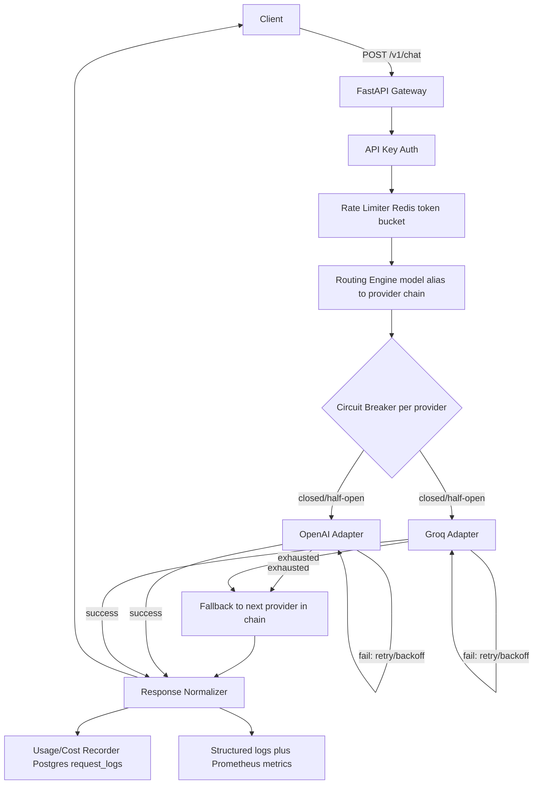

# LLM Gateway

A production-oriented backend service that provides a single, unified API for multiple LLM providers (OpenAI and Groq), with automatic fallback, per-key rate limiting, per-provider circuit breaking, token/cost tracking, and observability. A client talks only to this gateway -- never directly to a provider -- and gets back a normalized response regardless of which provider actually served the request.

This is a portfolio project built to demonstrate backend engineering, reliability engineering, and API design under a deliberately tight scope (see [Limitations](#limitations--future-improvements) below for what was intentionally left out). The full design rationale and phase-by-phase build plan live in [`PLAN.md`](./PLAN.md).

---

## Table of contents

- [What this is (and isn't)](#what-this-is-and-isnt)
- [Architecture](#architecture)
- [Request flow](#request-flow)
- [Authentication](#authentication)
- [Routing & fallback](#routing--fallback)
- [Retry behavior](#retry-behavior)
- [Rate limiting](#rate-limiting)
- [Circuit breaker](#circuit-breaker)
- [Usage & cost tracking](#usage--cost-tracking)
- [Observability](#observability)
- [API reference](#api-reference)
- [Local setup](#local-setup)
- [Docker setup](#docker-setup)
- [Environment variables](#environment-variables)
- [Example usage](#example-usage)
- [Testing strategy](#testing-strategy)
- [Benchmark tooling](#benchmark-tooling)
- [Limitations & future improvements](#limitations--future-improvements)

---

## What this is (and isn't)

**Implemented and working today:**
- Unified `POST /v1/chat` endpoint over OpenAI and Groq
- Config-driven routing with automatic fallback between providers
- Retry with exponential backoff on transient provider failures
- Redis-backed per-API-key rate limiting (token bucket)
- Per-provider circuit breaker (CLOSED -> OPEN -> HALF_OPEN)
- Token usage and estimated-cost tracking, persisted per request
- Structured JSON request logging and Prometheus metrics
- `/health`, `/metrics`, `/stats` endpoints
- An 89-test automated suite with zero real network calls
- A benchmark CLI (`benchmark/run_benchmark.py`) for measuring the above against a live instance

**Explicitly not implemented** (see [Limitations](#limitations--future-improvements) for the full list and why): streaming responses, more than two providers, adaptive/ML-based routing, multi-instance/shared circuit-breaker state, an admin UI, and full auth (this project uses simple static API keys, not OAuth/JWT).

This is not a RAG or agent framework -- it's a routing/reliability layer that sits in front of LLM providers.

---

## Architecture



**Layers, from the repo structure:**

| Layer | Path | Responsibility |
|---|---|---|
| HTTP API | `app/api/` | Thin FastAPI routes: `/v1/chat`, `/health`, `/metrics`, `/stats`. No business logic. |
| Auth | `app/auth/` | SHA-256 API key hashing + lookup. |
| Rate limiting | `app/ratelimit/` | Redis Lua-script token bucket. |
| Routing | `app/routing/` | Model-alias -> provider-chain config (YAML) plus the router that walks the chain. |
| Providers | `app/providers/` | OpenAI/Groq adapters behind a common `ProviderAdapter` interface. |
| Reliability | `app/reliability/` | Generic retry/backoff helper + per-provider circuit breaker. Reusable outside the router. |
| Usage | `app/usage/` | `RequestLog` model, repository, and cost calculator (reads `app/pricing/pricing.yaml`). |
| Observability | `app/observability/` | Structured JSON logging + Prometheus metric definitions. |
| DB | `app/db/` | Async SQLAlchemy engine/session; schema lives in a single `init.sql` (no migration tool -- see [Limitations](#limitations--future-improvements)). |

---

## Request flow

1. **Auth** -- `Authorization: Bearer <key>` is hashed and looked up in `api_keys`. Missing/invalid/inactive key -> `401`.
2. **Rate limit** -- the key's bucket (Redis) is checked *before* any provider is contacted. Exceeded -> `429`, and the rejected request is logged with zero cost/latency since no provider call was made.
3. **Validation** -- the request body is validated (non-empty `messages`, known `role`s, non-empty `content`). Malformed -> `400`.
4. **Routing** -- the requested `model` (a logical alias, e.g. `"fast-cheap"`) resolves to an ordered list of `{provider, model}` entries from `app/routing/model_aliases.yaml`. Unknown alias -> `400`.
5. **Circuit breaker + retry, per provider in the chain** -- a provider whose breaker is OPEN is skipped with no network call. Otherwise the adapter is called with retry/backoff; if all retries for that provider are exhausted, the router falls back to the next entry in the chain.
6. **All providers exhausted** -> `502` with a per-provider attempt summary (no raw provider payloads or secrets included).
7. **Success** -- the response is normalized to a single schema regardless of provider, usage/cost is computed and persisted, and a structured log line + metrics are emitted.

Every terminal outcome (success, fallback-success, rate-limited, all-failed) writes exactly one row to `request_logs`.

---

## Authentication

Client-facing API keys are simple, static, hashed tokens -- **not** OAuth/JWT (a deliberate scope decision; see [Limitations](#limitations--future-improvements)).

- Keys are generated and seeded via `scripts/seed_api_keys.py`, which prints the raw key **once**.
- Only a SHA-256 hash is stored in `api_keys.key_hash` -- the raw key is never persisted or logged.
- Requests authenticate via `Authorization: Bearer <raw-key>`.
- Each key can carry its own `rate_limit_per_min` override; if unset, the gateway falls back to `DEFAULT_RATE_LIMIT_PER_MIN`.

---

## Routing & fallback

Routing is intentionally static and config-driven -- **not** ML-based or adaptive -- per the project's scope decisions. `app/routing/model_aliases.yaml` maps a logical model name to an ordered provider/model chain:

```yaml
model_aliases:
  fast-cheap:
    - {provider: groq, model: llama-3.1-8b-instant}
    - {provider: openai, model: gpt-4o-mini}
  balanced:
    - {provider: openai, model: gpt-4o-mini}
    - {provider: groq, model: llama-3.1-8b-instant}
  premium:
    - {provider: openai, model: gpt-4o}
```

The client only ever specifies the alias (`"fast-cheap"`, `"balanced"`, `"premium"`) -- never a provider-specific model string. The router (`app/routing/router.py`) walks the chain in order; the first provider that succeeds (after its own retries) serves the request. If an earlier entry in the chain failed or was skipped (circuit open), the response's `fallback_occurred` field is `true`, and the attempt history is captured internally for logging.

---

## Retry behavior

Implemented in `app/reliability/retry.py`, used by the router around every provider call:

- **Retryable**: connection errors, timeouts, HTTP 5xx, HTTP 429 from the provider.
- **Not retryable** (falls through to the next provider immediately): HTTP 400/401/403/404 from the provider.
- **Policy**: up to 3 attempts total (1 initial + 2 retries) per provider, exponential backoff starting at 0.25s, doubling each time, capped at 2s, with up to 10% jitter.

This is a small, generic, independently-testable helper -- not baked into the provider adapters themselves, so it can wrap any awaitable call.

---

## Rate limiting

Implemented in `app/ratelimit/limiter.py`:

- **Algorithm**: token bucket, continuously refilled based on elapsed time, executed as a single atomic Redis Lua script (`EVAL`) so concurrent requests for the same key can't race past the limit.
- **Scope**: per API key, per minute. Capacity is the key's `rate_limit_per_min` override, or `DEFAULT_RATE_LIMIT_PER_MIN` if unset.
- **State**: a Redis hash at `ratelimit:{api_key_id}` (tokens remaining, last refill timestamp), with a TTL slightly above the refill window so idle keys clean up automatically.
- **On exceed**: `429` with `{"error": "rate_limit_exceeded", "retry_after_seconds": <n>}` and a `Retry-After` header. No provider is ever contacted for a rejected request.

Why Redis and not an in-process counter: an in-process counter wouldn't survive a restart and wouldn't work correctly across multiple gateway instances/workers -- Redis gives correct shared state.

---

## Circuit breaker

Implemented in `app/reliability/circuit_breaker.py`, one instance per provider, held by the `Router`:

- **CLOSED** -- normal operation. Consecutive failures are counted; reaching `CIRCUIT_BREAKER_FAILURE_THRESHOLD` (default 5) trips the breaker OPEN.
- **OPEN** -- calls to that provider are skipped entirely (no network attempt) for `CIRCUIT_BREAKER_COOLDOWN_SECONDS` (default 30s).
- **HALF_OPEN** -- once the cooldown elapses, exactly one trial request is allowed through. Success closes the breaker and resets the failure count; failure reopens it and restarts the cooldown.

OpenAI and Groq each have their own independent breaker -- one provider tripping never affects the other. Current state per provider is visible at `GET /health`.

This is in-process, per-gateway-instance state (not shared via Redis across replicas) -- an intentional simplification for a single-instance deployment; see [Limitations](#limitations--future-improvements).

---

## Usage & cost tracking

Every request writes one row to `request_logs` (`app/usage/models.py` / `repository.py`) with: provider, model, token counts, estimated cost, latency, status, and fallback flag. Token counts come directly from each provider's own reported usage -- no local tokenization/estimation.

Cost is computed by `app/usage/cost_calculator.py` from `app/pricing/pricing.yaml` -- pricing is data, never hardcoded in application logic:

```yaml
openai:
  gpt-4o-mini: {input_per_1k: 0.00015, output_per_1k: 0.0006}
  gpt-4o: {input_per_1k: 0.0025, output_per_1k: 0.01}
groq:
  llama-3.1-8b-instant: {input_per_1k: 0.00005, output_per_1k: 0.00008}
```

Warning: these are placeholder figures snapshotted at build time -- verify against each provider's current published pricing before relying on them for anything beyond a demo.

---

## Observability

- **Structured logging** (`app/observability/logging_config.py`): one JSON log line per `/v1/chat` request -- `request_id`, `api_key_label`, `model_alias`, `provider_used`, `status`, `latency_ms`, `fallback_occurred`. **Message content is never logged.**
- **Prometheus metrics** (`app/observability/metrics.py`), exposed at `GET /metrics`:
  - `gateway_requests_total{status, provider, model_alias}`
  - `gateway_request_latency_seconds{provider}`
  - `gateway_fallback_events_total{from_provider, to_provider}`
  - `gateway_rate_limit_exceeded_total{api_key_label}`
  - `gateway_tokens_total{provider, direction}`
  - `gateway_estimated_cost_usd_total{provider}`
- No Prometheus/Grafana server is bundled -- `/metrics` is just an exposition endpoint for an external scraper.

### `/health`, `/metrics`, `/stats`

| Endpoint | Purpose |
|---|---|
| `GET /health` | Liveness, plus each provider's current circuit-breaker state: `{"status": "ok", "providers": {"openai": {"circuit_state": "closed"}, "groq": {...}}}`. Does **not** currently check Postgres/Redis connectivity -- only the gateway process's own liveness and its view of provider health. |
| `GET /metrics` | Prometheus exposition format, for scraping. |
| `GET /stats` | Human-readable JSON summary computed from the last 1000 `request_logs` rows: total requests, success rate, fallback rate, average latency, total estimated cost, and a per-provider breakdown. No auth required (read-only aggregate, no per-key data exposed). |

---

## API reference

### `POST /v1/chat`

**Headers:** `Authorization: Bearer <api_key>`

**Request:**
```json
{
  "model": "fast-cheap",
  "messages": [{"role": "user", "content": "Hello"}],
  "max_tokens": 256,
  "temperature": 0.7
}
```
`role` must be one of `system`, `user`, `assistant`. `max_tokens`/`temperature` are optional.

**200 response:**
```json
{
  "id": "req_8f3a1c2d9e01",
  "model_alias": "fast-cheap",
  "provider": "groq",
  "model": "llama-3.1-8b-instant",
  "content": "Hello! How can I help you today?",
  "usage": {
    "input_tokens": 8,
    "output_tokens": 12,
    "total_tokens": 20,
    "estimated_cost_usd": 0.000034
  },
  "latency_ms": 412,
  "fallback_occurred": false
}
```

**Error responses:**
| Status | Body | Cause |
|---|---|---|
| `400` | `{"error": "invalid_request", "message": [...]}` | Malformed body (missing/empty `messages`, invalid `role`, empty `content`) |
| `400` | `{"error": "invalid_request", "message": "Unknown model alias: '...'"}` | `model` isn't a configured alias |
| `401` | -- | Missing/invalid/inactive API key |
| `429` | `{"error": "rate_limit_exceeded", "retry_after_seconds": N}` + `Retry-After` header | Per-key rate limit exceeded |
| `502` | `{"error": "all_providers_failed", "attempts": [{"provider", "error_type", "message"}, ...]}` | Every provider in the chain failed or was circuit-broken |

### `GET /health`, `GET /metrics`, `GET /stats`
See [Observability](#observability) above.

---

## Local setup

```bash
git clone <this-repo>
cd llm-gateway
cp .env.example .env
# edit .env: set OPENAI_API_KEY / GROQ_API_KEY if you want real provider calls
pip install -r requirements.txt
```

Run the automated test suite (no Docker, no API keys, no network needed):
```bash
pytest
```

To actually run the gateway locally without Docker, you'll need a Postgres and Redis instance reachable at the URLs in `.env` (or point `DATABASE_URL`/`REDIS_URL` at ones you already have running), then:
```bash
python scripts/seed_api_keys.py demo-client
uvicorn app.main:app --reload
```

## Docker setup

```bash
cp .env.example .env
docker-compose up --build
```

This brings up three containers: `gateway` (the FastAPI app), `db` (Postgres 16, schema applied automatically from `app/db/migrations/init.sql`), and `redis` (Redis 7). Once it's up:

```bash
docker-compose exec gateway python scripts/seed_api_keys.py demo-client
curl http://localhost:8000/health
curl http://localhost:8000/v1/chat \
  -H "Authorization: Bearer <the-key-you-just-seeded>" \
  -H "Content-Type: application/json" \
  -d '{"model": "fast-cheap", "messages": [{"role": "user", "content": "Hello"}]}'
```

> **Docker verification note:** the environment this project was built in does not have Docker installed, so `docker-compose up --build` could not be executed as part of this build. The Dockerfile and `docker-compose.yml` were manually reviewed against the current application (correct `requirements.txt`, correct `init.sql` mount, correct env vars) but have **not** been verified end-to-end by actually running them. If you hit an issue running this locally, please open an issue with the exact error.

---

## Environment variables

All variables are listed in `.env.example`. Never commit a real `.env`.

| Variable | Default | Notes |
|---|---|---|
| `OPENAI_API_KEY` | _(empty)_ | Required for real OpenAI calls |
| `GROQ_API_KEY` | _(empty)_ | Required for real Groq calls |
| `DATABASE_URL` | `postgresql+asyncpg://gateway:gateway@db:5432/gateway` | |
| `POSTGRES_USER` / `POSTGRES_PASSWORD` / `POSTGRES_DB` | `gateway` / `gateway` / `gateway` | Used by the `db` container's own init, not read by the app directly |
| `REDIS_URL` | `redis://redis:6379/0` | |
| `DEFAULT_RATE_LIMIT_PER_MIN` | `60` | Fallback when an API key has no override |
| `CIRCUIT_BREAKER_FAILURE_THRESHOLD` | `5` | Consecutive failures before a provider's breaker opens |
| `CIRCUIT_BREAKER_COOLDOWN_SECONDS` | `30` | How long a breaker stays OPEN before allowing a HALF_OPEN probe |
| `RETRY_MAX_ATTEMPTS` | `3` | Present in config for forward-compatibility, but the retry helper (`app/reliability/retry.py`) currently uses its own internal constant (also `3`) rather than reading this setting -- changing this env var has no effect today. Documented here for accuracy rather than silently hidden. |
| `LOG_LEVEL` | `INFO` | |

---

## Example usage

```bash
# Health + circuit breaker state
curl http://localhost:8000/health

# A chat request
curl http://localhost:8000/v1/chat \
  -H "Authorization: Bearer $GATEWAY_API_KEY" \
  -H "Content-Type: application/json" \
  -d '{
        "model": "balanced",
        "messages": [{"role": "user", "content": "Write a haiku about databases."}]
      }'

# Prometheus metrics
curl http://localhost:8000/metrics

# Human-readable usage summary
curl http://localhost:8000/stats
```

---

## Testing strategy

**89 automated tests, zero real network calls, zero provider API keys required.** Run with:
```bash
pytest                                        # full suite
pytest --cov=app --cov-report=term-missing    # with coverage (pytest-cov)
```

- **Providers**: all OpenAI/Groq HTTP calls are mocked with `respx` -- no real request ever leaves the test process.
- **Redis**: `fakeredis` stands in for the rate limiter's Redis backend, including full Lua-script support.
- **Postgres**: tests use an in-memory SQLite database with an equivalent schema (dialect-agnostic by design) rather than a real Postgres instance, so the suite needs no Docker/external services at all.
- **Coverage**: last measured at 99% (555/560 statements). The 5 uncovered lines are exclusively the real-Postgres-engine and real-Redis-backed production wiring in `app/db/base.py` and `app/deps.py` -- every test deliberately overrides these via FastAPI's `dependency_overrides` to avoid touching real infrastructure, so those specific lines are only ever exercised when the app actually runs against real Postgres/Redis (i.e., in Docker). This is expected, not a gap.

Test files map onto specific scenarios: successful requests (`test_chat_success.py`), retry-without-fallback (`test_chat_provider_failure_and_retry.py`), fallback (`test_chat_fallback.py`), all-providers-failing (`test_chat_provider_failure.py`), rate limiting (`test_rate_limiting.py`), cost calculation (`test_cost_calculation.py`), malformed requests (`test_malformed_request.py`), response normalization for both providers (`test_response_normalization.py`, `test_groq_adapter.py`), and the circuit breaker state machine plus its router/health-endpoint integration (`test_circuit_breaker.py`, `test_circuit_breaker_router_integration.py`, `test_health_circuit_state.py`).

---

## Benchmark tooling

`benchmark/run_benchmark.py` + `benchmark/scenarios.py` implement four scenarios against a **running** gateway instance over real HTTP:

1. **Baseline throughput/latency** -- concurrent requests with both providers healthy; p50/p95/p99 latency, success rate, req/sec.
2. **Forced fallback** -- run after manually making the primary provider unreachable; measures fallback rate and added latency.
3. **Rate limit behavior** -- confirms the configured limit is enforced (accepted vs `429`).
4. **All-providers-down recovery** -- confirms a clean `502` with no crash, then measures time-to-first-success after connectivity is restored.

```bash
python benchmark/run_benchmark.py --scenario baseline_throughput \
  --base-url http://localhost:8000 --api-key <gateway-key>
```
See the module docstring in `run_benchmark.py` for the full command set, including how to blackhole a provider for scenarios 2 and 4 (no code changes needed -- it's a network-level operation against the running container).

**Benchmark status: tooling is complete and validated, but no real-provider run has been performed.** The environment this project was built and iterated in has no OpenAI/Groq API keys and no network access to `api.openai.com`/`api.groq.com`, so the authoritative `benchmark/results/report.md` (with real provider latencies) has **not** been generated, and no such file is included in this repository. What *is* included, under `benchmark/results/`, is a clearly-labeled validation run (`VALIDATION_DRY_RUN_REPORT.md` and `validation_dry_run_*.json`) that exercised the real FastAPI app, real auth, real rate limiter, real circuit breaker, and real database writes -- with only the leaf provider call replaced by a deterministic fake, since no real provider was reachable. It proves the tooling itself is correct; it is **not** a substitute for a real-provider benchmark and is explicitly labeled as such in that file.

To produce the real report: run `docker-compose up --build` with real API keys in `.env`, seed a key, and run `python benchmark/run_benchmark.py --scenario all`.

---

## Limitations & future improvements

**Limitations (intentional, time-boxed scope decisions):**
- No streaming responses (request/response only)
- Only two providers (OpenAI, Groq)
- Static, config-based routing -- no adaptive/learned routing
- Circuit breaker state is in-process per gateway instance, not shared across replicas (fine for a single-instance deployment; would need Redis-backed state for horizontal scaling)
- No admin UI for managing API keys or pricing -- both are config/DB-seed driven
- Schema managed via a single `init.sql` rather than a migration tool (Alembic, etc.)
- `RETRY_MAX_ATTEMPTS` is defined in config but not currently wired into the retry helper (see [Environment variables](#environment-variables))
- `/health` reports provider circuit state but does not check actual Postgres/Redis connectivity
- No real-provider benchmark run exists yet (see [Benchmark tooling](#benchmark-tooling)) -- the tooling is complete and validated, but running it against real OpenAI/Groq requires infrastructure/credentials not available in this build environment
- Simple static API keys, not OAuth/JWT

**Future improvements (explicitly out of scope for this build):**
- SSE/streaming support
- Additional providers (Anthropic, Gemini) via the existing adapter pattern
- Shared circuit-breaker state via Redis for multi-instance deployments
- Adaptive routing based on live observed latency/cost
- A Prometheus + Grafana stack for live dashboards (today it's just the `/metrics` endpoint)
- Proper auth (OAuth/JWT) and self-service API key management
- Wiring `RETRY_MAX_ATTEMPTS` through to the retry helper, and adding real Postgres/Redis checks to `/health`
