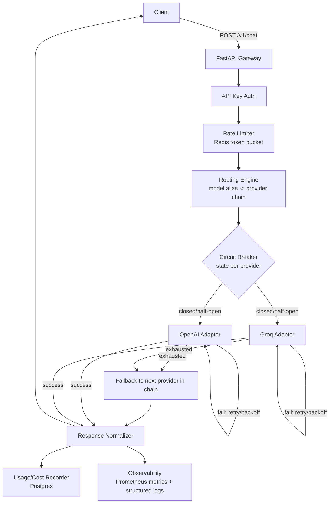

# PLAN.md — LLM Gateway: Multi-Provider LLM Gateway with Rate Limiting, Fallback Routing, Cost Tracking & Observability

## 0. Overview

This document is the complete engineering blueprint for building **LLM Gateway**, a production-oriented, single-process backend service that provides a unified API for sending requests to multiple LLM providers (OpenAI and Groq), with automatic fallback, rate limiting, token/cost tracking, and observability.

This plan is designed to be executed by an autonomous coding agent (Claude Code) in **~30 focused engineering hours**. It intentionally avoids over-engineering. Every included component is justified by resume/interview value, demo value, and feasibility within the time budget.

**Providers chosen: OpenAI and Groq.**
Rationale: two providers is the minimum needed to meaningfully demonstrate fallback/routing behavior. OpenAI is the most recognizable provider for interview conversations. Groq is included because it is OpenAI-API-compatible (chat completions schema), which minimizes adapter-writing effort while still being a genuinely distinct provider (different infra, different failure modes, very low latency — useful for demoing fast fallback). Gemini is excluded to keep the provider count minimal and because its API shape differs enough to cost extra adapter time without adding proportional engineering value.

---

## 1. IN SCOPE / OUT OF SCOPE

### IN SCOPE
- FastAPI-based gateway exposing a unified `/v1/chat` endpoint
- Provider adapter pattern with two real providers: OpenAI, Groq
- Config-driven routing: explicit model selection + a routing policy with primary/fallback provider ordering per logical "model alias"
- Retry with backoff on transient/retryable failures per provider
- Fallback to next provider/model in the routing chain when a provider exhausts retries or is marked unhealthy
- Token-bucket or sliding-window rate limiting per API key, backed by Redis
- Simple API key model: a small static table of API keys (in Postgres or even a config file) — no signup flow, no OAuth
- Token usage + estimated cost tracking, persisted to PostgreSQL, with pricing defined in a config file (not hardcoded in logic)
- Structured JSON logging + Prometheus-style metrics endpoint (`/metrics`) + a small in-memory/DB-backed stats endpoint for a human-readable summary
- Health check endpoint (`/health`) that reports gateway liveness and last-known provider health state
- Background/periodic lightweight provider health probing (or health-on-demand with circuit breaker state) — kept simple
- Circuit breaker (simple, in-process, per provider) to avoid hammering a known-down provider
- Automated tests with pytest, providers fully mocked (no real API keys needed to run test suite)
- A benchmark script (Python, using `httpx`/`asyncio` or `locust`-lite custom script) that exercises the gateway and records real, reproducible measurements
- Docker Compose setup: gateway + Postgres + Redis
- README with architecture diagram (Mermaid, embedded in README — renders directly on GitHub, no separate diagramming tool needed) and full documentation

### OUT OF SCOPE (explicitly not built)
- Kubernetes or any container orchestration beyond Docker Compose
- Multi-tenancy, org/user hierarchies, RBAC
- Full authentication system (OAuth, JWT refresh flows, user signup/login UI)
- Billing/invoicing system
- Frontend UI/dashboard (observability is via `/metrics`, `/stats`, logs, and the README's benchmark report — not a web dashboard)
- ML-based or adaptive/learned routing — routing is static config plus simple health-based exclusion
- Streaming responses (SSE/websocket token streaming) — v1 is request/response only; noted as future work
- More than 2 providers
- Semantic caching, embeddings, RAG (this is explicitly not a RAG project — that's Finora's domain)
- Distributed tracing across services (single service — deep distributed tracing has no target; structured logs + metrics suffice)
- Horizontal scaling / multi-instance coordination beyond what Redis naturally gives us for rate limiting
- Admin UI for managing API keys or pricing — these are config-file/DB-seed driven

---

## 2. Architecture



**Request lifecycle:**
1. Client sends `POST /v1/chat` with an API key header, a logical `model` (alias), and messages.
2. API key is validated (simple lookup).
3. Rate limiter checks/decrements the caller's token bucket in Redis. If exceeded → `429`.
4. Router resolves the `model` alias to an ordered provider/model chain (e.g., `["openai:gpt-4o-mini", "groq:llama-3.1-8b-instant"]`).
5. For each provider in the chain, in order:
   - If circuit breaker is OPEN for that provider, skip immediately to next.
   - Otherwise call the provider adapter with retry+backoff for retryable errors.
   - On success: stop, normalize response.
   - On exhaustion: record failure, trip circuit breaker if threshold met, move to next provider in chain (this is the "fallback event").
6. If all providers in the chain fail: return a normalized `502`-style gateway error with details of what was attempted.
7. Usage recorder persists a row with tokens, cost, latency, provider, status.
8. Metrics/log emitters record counters and histograms.
9. Response returned to client in a single normalized schema regardless of which provider served it.

---

## 3. Repository Structure

```
llm-gateway/
├── README.md
├── PLAN.md
├── docker-compose.yml
├── Dockerfile
├── pyproject.toml / requirements.txt
├── .env.example
├── alembic.ini                      # simple migrations (or a single init.sql if we skip alembic — see Phase 2 decision)
├── app/
│   ├── main.py                      # FastAPI app factory, route registration
│   ├── config.py                    # settings via pydantic-settings, loads .env
│   ├── deps.py                      # FastAPI dependencies (db session, redis client, api key auth)
│   ├── api/
│   │   ├── routes_chat.py           # POST /v1/chat
│   │   ├── routes_health.py         # GET /health
│   │   ├── routes_stats.py          # GET /stats (human-readable usage summary)
│   │   └── routes_metrics.py        # GET /metrics (Prometheus exposition)
│   ├── auth/
│   │   └── api_keys.py              # API key lookup + validation
│   ├── ratelimit/
│   │   └── limiter.py               # Redis token-bucket implementation
│   ├── routing/
│   │   ├── config.py                # model alias -> provider chain definitions (loaded from YAML)
│   │   └── router.py                # resolves alias, iterates chain, orchestrates retry/fallback
│   ├── providers/
│   │   ├── base.py                  # ProviderAdapter abstract base class + normalized request/response dataclasses
│   │   ├── openai_adapter.py
│   │   ├── groq_adapter.py
│   │   └── errors.py                # ProviderError hierarchy (RetryableError, FatalError, RateLimitedError, etc.)
│   ├── reliability/
│   │   ├── retry.py                 # backoff/retry decorator or helper
│   │   └── circuit_breaker.py       # simple per-provider circuit breaker (closed/open/half-open)
│   ├── pricing/
│   │   └── pricing.yaml             # $ per 1K input/output tokens, per provider+model
│   ├── usage/
│   │   ├── models.py                # SQLAlchemy models: RequestLog
│   │   ├── repository.py            # insert/query usage rows
│   │   └── cost_calculator.py       # reads pricing.yaml, computes estimated cost
│   ├── observability/
│   │   ├── logging_config.py        # structlog/json logging setup
│   │   └── metrics.py               # prometheus_client counters/histograms
│   └── db/
│       ├── base.py                  # SQLAlchemy engine/session setup
│       └── migrations/              # alembic migration scripts OR init.sql
├── tests/
│   ├── conftest.py                  # fixtures: test client, fake redis, fake db (sqlite or testcontainers-lite), mocked providers
│   ├── test_chat_success.py
│   ├── test_chat_provider_failure_and_retry.py
│   ├── test_chat_fallback.py
│   ├── test_chat_all_providers_fail.py
│   ├── test_rate_limiting.py
│   ├── test_cost_calculation.py
│   ├── test_malformed_request.py
│   ├── test_response_normalization.py
│   └── test_circuit_breaker.py
├── benchmark/
│   ├── run_benchmark.py             # async load generator hitting the gateway
│   ├── scenarios.py                 # e.g. "baseline", "forced fallback", "rate-limit trip"
│   └── results/                     # output CSV/JSON + a generated report.md with real numbers
└── scripts/
    └── seed_api_keys.py             # inserts sample API keys into Postgres for local dev
```

**Why each top-level dir exists:**
- `app/api` — thin HTTP layer only; no business logic lives here.
- `app/routing` — the "brain" that decides provider order; kept separate from adapters so routing logic is unit-testable without network mocking.
- `app/providers` — isolates all provider-specific request/response translation behind one interface (`ProviderAdapter.send(request) -> NormalizedResponse`). Adding a third provider later means adding one file here.
- `app/reliability` — retry and circuit breaker are generic, reusable, and independently testable; not embedded inline in the router.
- `app/pricing` — pricing is data, not code, per the requirement to never hardcode pricing in logic.
- `app/usage` — persistence and cost math are separate from HTTP and provider concerns.
- `benchmark/` — kept out of `app/` since it's a dev tool, not part of the deployed service.

---

## 4. Data Model (PostgreSQL)

Minimal schema — two tables.

### `api_keys`
| column | type | notes |
|---|---|---|
| id | uuid, PK | |
| key_hash | text, unique | store a hash, not the raw key |
| label | text | human-readable name, e.g. "demo-client" |
| rate_limit_per_min | int | overrideable per-key limit; falls back to global default |
| created_at | timestamptz | |
| active | boolean | default true |

### `request_logs`
| column | type | notes |
|---|---|---|
| id | uuid, PK | |
| api_key_id | uuid, FK -> api_keys.id | nullable if key deleted later (ON DELETE SET NULL) |
| model_alias | text | logical model requested by client |
| provider_used | text | e.g. "openai", "groq"; null if all failed |
| model_used | text | actual underlying model string |
| status | text | enum-like: "success", "fallback_success", "all_failed", "rate_limited", "invalid_request" |
| attempt_count | int | total provider attempts including retries |
| fallback_occurred | boolean | |
| input_tokens | int | nullable |
| output_tokens | int | nullable |
| total_tokens | int | nullable |
| estimated_cost_usd | numeric(12,6) | nullable |
| latency_ms | int | end-to-end gateway latency |
| error_message | text | nullable, truncated, no sensitive payload content |
| created_at | timestamptz | indexed |

**Indexes:** `created_at` (for time-range stats queries), `api_key_id` (for per-key usage queries), `status` (for filtering failure analysis).

**Why so minimal:** the requirement is explicit — no giant data model. These two tables support every required metric (cost, tokens, fallback rate, latency, per-key usage) without needing a normalized "providers"/"models"/"pricing" table set — pricing lives in config (`pricing.yaml`), not in the DB, since it changes rarely and doesn't need relational integrity.

**Migration approach decision:** Use a single `init.sql` run at container startup rather than full Alembic, to save setup time — this is a portfolio project, not a project needing migration history. Document this tradeoff explicitly in the README. (If the coding agent judges Alembic to be low-cost to add, it's an acceptable upgrade, but not required.)

---

## 5. API Specification

### `POST /v1/chat`
**Purpose:** Send a chat completion request through the gateway.

**Headers:** `Authorization: Bearer <api_key>`

**Request body:**
```json
{
  "model": "fast-cheap",
  "messages": [
    {"role": "user", "content": "Hello"}
  ],
  "max_tokens": 256,
  "temperature": 0.7
}
```
`model` is a **logical alias** defined in `routing/config.py` (e.g. `"fast-cheap"`, `"balanced"`, `"premium"`), not a raw provider model string. This is what makes the client provider-agnostic.

**Success response (200):**
```json
{
  "id": "req_8f3...",
  "model_alias": "fast-cheap",
  "provider": "groq",
  "model": "llama-3.1-8b-instant",
  "content": "Hello! How can I help you today?",
  "usage": {
    "input_tokens": 8,
    "output_tokens": 12,
    "total_tokens": 20,
    "estimated_cost_usd": 0.000034
  },
  "latency_ms": 412,
  "fallback_occurred": false
}
```

**Error responses:**
- `400` — malformed request (missing `messages`, invalid role, empty content, unknown `model` alias)
- `401` — missing/invalid API key
- `429` — rate limit exceeded, body includes `retry_after_seconds`
- `502` — all providers in the chain failed; body includes which providers were attempted and their failure reasons (`attempts: [{provider, error_type, message}]`)
- `500` — unexpected internal error (should be rare; logged with full trace server-side, generic message to client)

### `GET /health`
**Purpose:** Liveness + dependency/provider status snapshot.
**Response (200):**
```json
{
  "status": "ok",
  "dependencies": {"postgres": "ok", "redis": "ok"},
  "providers": {
    "openai": {"circuit_state": "closed", "last_success_at": "...", "last_failure_at": null},
    "groq": {"circuit_state": "closed", "last_success_at": "...", "last_failure_at": null}
  }
}
```
Returns `503` if Postgres or Redis is unreachable. Provider circuit state being "open" does NOT fail the health check (gateway itself is still healthy — it's correctly protecting against a down provider); this distinction is worth calling out in interviews.

### `GET /metrics`
Prometheus exposition format (via `prometheus_client`). Exposes:
- `gateway_requests_total{status, provider, model_alias}`
- `gateway_request_latency_seconds{provider}` (histogram)
- `gateway_fallback_events_total{from_provider, to_provider}`
- `gateway_rate_limit_exceeded_total{api_key_label}`
- `gateway_tokens_total{provider, direction="input"|"output"}`
- `gateway_estimated_cost_usd_total{provider}`

### `GET /stats`
**Purpose:** Human-readable JSON summary for demoing without a Prometheus/Grafana stack (out of scope per time budget).
**Response:**
```json
{
  "window": "last_1000_requests",
  "total_requests": 1000,
  "success_rate": 0.97,
  "fallback_rate": 0.04,
  "avg_latency_ms": 388,
  "total_estimated_cost_usd": 0.42,
  "by_provider": {
    "openai": {"requests": 620, "success_rate": 0.98},
    "groq": {"requests": 380, "success_rate": 0.95}
  }
}
```
Computed via a query against `request_logs` (last N rows or last time window, whichever's simpler to implement well).

---

## 6. Provider Abstraction

`app/providers/base.py` defines:

```python
class NormalizedRequest:
    messages: list[dict]
    max_tokens: int | None
    temperature: float | None

class NormalizedResponse:
    content: str
    input_tokens: int
    output_tokens: int
    raw_provider_model: str

class ProviderAdapter(ABC):
    name: str
    def is_retryable_error(self, exc: Exception) -> bool: ...
    async def send(self, model: str, request: NormalizedRequest) -> NormalizedResponse: ...
```

Each concrete adapter (`OpenAIAdapter`, `GroqAdapter`) implements `send()` using the respective official/HTTP client, and maps provider-specific exceptions (timeout, 429, 5xx, connection error) into the shared `app/providers/errors.py` hierarchy:
- `RetryableProviderError` (timeouts, 5xx, connection errors) → eligible for retry within the same provider
- `ProviderRateLimitedError` (429 from provider) → eligible for retry with longer backoff, or immediate fallback depending on config
- `FatalProviderError` (400 invalid request to provider, auth failure) → no retry, no point falling back either since it's likely a request-shape issue — but current design still allows fallback to next provider in case it's provider-specific auth/config issue, and this tradeoff is documented as a discussion point in the README

Because Groq's chat completions API is OpenAI-compatible, `GroqAdapter` can subclass or heavily reuse `OpenAIAdapter`'s HTTP logic with a different base URL/model list — this is a good interview talking point ("adapter pattern let me add a second provider in under an hour").

---

## 7. Routing Design

`app/routing/config.py` — a YAML or Python dict, e.g.:

```yaml
model_aliases:
  fast-cheap:
    - {provider: groq, model: llama-3.1-8b-instant}
    - {provider: openai, model: gpt-4o-mini}
  balanced:
    - {provider: openai, model: gpt-4o-mini}
    - {provider: groq, model: llama-3.1-8b-instant}
  premium:
    - {provider: openai, model: gpt-4o}
```

`router.py`:
- Resolves alias → ordered chain.
- Skips any provider whose circuit breaker is currently OPEN.
- For the first non-skipped provider, calls it via `reliability.retry` wrapper.
- If retry exhausts, records a fallback event and moves to next entry in chain.
- If chain exhausted, raises an `AllProvidersFailedError` with full attempt history, which `routes_chat.py` turns into the `502` response.

This is intentionally static/config-driven, not ML-based, per scope constraints — a clear, explainable interview answer: "routing is a priority-ordered chain per logical model, with health-aware skipping."

---

## 8. Retry + Fallback Semantics

**Retryable failures (within same provider):** connection errors, timeouts, HTTP 5xx, HTTP 429 from provider (with respect for `Retry-After` if present).
**Non-retryable (move straight to fallback, no same-provider retry):** HTTP 400/401/403/404 from provider (malformed request or auth issue — retrying won't help).

**Retry policy:** max 2 retries per provider (3 attempts total), exponential backoff with jitter: base 0.25s, multiplier 2, capped at 2s.

**Fallback trigger:** a provider is abandoned (moved past) when its retry budget is exhausted OR its circuit breaker is already OPEN when the router reaches it.

**Circuit breaker (`reliability/circuit_breaker.py`):** per-provider, in-process, simple 3-state machine:
- CLOSED: normal operation.
- OPEN: after N consecutive failures (config, default 5) within a rolling window, trip to OPEN for a cooldown period (default 30s) — during this time the router skips the provider immediately without attempting a call.
- HALF_OPEN: after cooldown, allow exactly one trial request through; success → CLOSED, failure → OPEN again (reset cooldown).

**All-providers-failed behavior:** return `502` with `attempts` array showing each provider tried, error type, and attempt count. This is logged as a distinct `status="all_failed"` row in `request_logs` and increments a dedicated metric — this is the scenario most worth highlighting in interviews ("what happens when everything is down").

**Observability of fallback:** every fallback (moving from provider A to provider B within one client request) increments `gateway_fallback_events_total` and is logged as a structured event with `request_id`, `from_provider`, `to_provider`, `reason`.

---

## 9. Rate Limiting

**Algorithm:** Token bucket, implemented in Redis via a Lua script (atomic check-and-decrement) — chosen over sliding-window-log for O(1) memory per key and simplicity.

**What's limited:** requests per API key per minute (configurable default, e.g. 60/min), overrideable per-key via the `rate_limit_per_min` column in `api_keys`.

**Storage:** Redis key `ratelimit:{api_key_id}` holding bucket state (tokens remaining, last refill timestamp), TTL set slightly above the refill window to auto-clean idle keys.

**On exceed:** `429` with JSON body `{"error": "rate_limit_exceeded", "retry_after_seconds": N}` and a `Retry-After` header. Logged as `status="rate_limited"` in `request_logs` with no provider call made (rate limiting happens before routing — cost/latency is 0, which is itself worth noting: rejected requests cost nothing).

**Why Redis and not in-memory:** in-memory counters don't survive process restarts and don't work correctly if the gateway is ever run with multiple workers/replicas — Redis gives correct shared state and is a natural "why did you choose this" interview answer.

---

## 10. Token & Cost Tracking

- `pricing/pricing.yaml`:
```yaml
openai:
  gpt-4o-mini: {input_per_1k: 0.00015, output_per_1k: 0.0006}
  gpt-4o: {input_per_1k: 0.0025, output_per_1k: 0.01}
groq:
  llama-3.1-8b-instant: {input_per_1k: 0.00005, output_per_1k: 0.00008}
```
(Placeholder numbers — the coding agent should pull current published pricing at implementation time and note the pricing snapshot date in the README, since prices change.)

- `usage/cost_calculator.py` loads this file once at startup, exposes `calculate_cost(provider, model, input_tokens, output_tokens) -> Decimal`.
- Token counts come directly from each provider's API response (both OpenAI and Groq return usage objects) — no local tokenization/estimation needed, which is simpler and more accurate than counting client-side.
- Every request (success, fallback-success, or all-failed) writes exactly one row to `request_logs`, so cost/usage aggregation (`/stats`) is a straightforward SQL query, not a separate tracking system.

---

## 11. Observability

- **Structured logging:** JSON logs via `structlog` (or plain `logging` + a JSON formatter if time-constrained), one log line per request with `request_id`, `api_key_label`, `model_alias`, `provider_used`, `status`, `latency_ms`, `fallback_occurred`. Never log full message content (avoid sensitive data in logs) — log message *count* and *character length* only, not content.
- **Metrics:** `prometheus_client` counters/histograms as listed in section 5, exposed at `/metrics`. No Prometheus/Grafana server is deployed as part of this project (out of scope) — the endpoint itself, plus a note in the README on how one would scrape it, is sufficient demo/interview value.
- **`/stats` endpoint:** DB-query-backed human-readable summary, used for the benchmark report and live demos without needing extra infra.

---

## 12. Health Checks

- `/health` checks: Postgres connectivity (`SELECT 1`), Redis connectivity (`PING`), and reports current circuit-breaker state per provider (no live network call to providers on every health check — that would be wasteful; circuit state is a cheap proxy for "is this provider currently considered healthy by the gateway").
- Optional lightweight active probing: a background task (asyncio task on startup) that pings each provider's lightweight endpoint (e.g., OpenAI's `/v1/models` with a short timeout) every 60s purely to keep circuit state fresh even during idle periods — marked as a "nice to have, cut if time-constrained" item in the phase plan (Phase 7).

---

## 13. Testing Plan

All provider calls mocked — no real API keys required to run `pytest`. Use `respx` or `unittest.mock` to intercept HTTP calls to OpenAI/Groq base URLs.

| Test file | Scenario |
|---|---|
| `test_chat_success.py` | Single provider succeeds on first attempt; response normalized correctly; usage row written |
| `test_chat_provider_failure_and_retry.py` | Provider fails twice (retryable) then succeeds on 3rd attempt; verify retry count and backoff invoked, no fallback |
| `test_chat_fallback.py` | Primary provider exhausts retries; secondary provider succeeds; verify `fallback_occurred=true`, correct provider in response, fallback metric incremented |
| `test_chat_all_providers_fail.py` | Both providers fail; verify `502`, `attempts` array populated, `status="all_failed"` row written |
| `test_rate_limiting.py` | Exceed configured limit; verify `429` and `retry_after_seconds`; verify limit resets after window |
| `test_cost_calculation.py` | Given known token counts + pricing fixture, verify exact cost math (multiple providers/models) |
| `test_malformed_request.py` | Missing `messages`, empty `messages`, unknown `model` alias, invalid `role` → all return `400` with clear error body |
| `test_response_normalization.py` | Given differently-shaped mocked OpenAI vs Groq responses, verify both map to the same `NormalizedResponse` schema |
| `test_circuit_breaker.py` | Simulate N consecutive failures → breaker OPENs → subsequent calls skip the provider without a network call → after cooldown, HALF_OPEN trial → success closes it |

**Fixtures (`conftest.py`):** a `TestClient` (httpx AsyncClient against the FastAPI app), a fake/test Redis (either `fakeredis` or a real Redis test container — prefer `fakeredis` for speed and no Docker dependency in unit tests), and a test Postgres (SQLite in-memory is acceptable for most tests if schema is simple enough to be dialect-agnostic; otherwise a Dockerized test Postgres via `pytest-docker` or `testcontainers` — pick whichever is faster to set up; document the choice).

**Completion bar:** all listed test files exist and pass; `pytest --cov` run once to sanity-check core modules (`routing`, `providers`, `reliability`, `usage`) have meaningful coverage — no specific coverage percentage target is prescribed (avoid inventing metrics), but obviously-uncovered critical paths should be flagged.

---

## 14. Benchmark / Demo Component

`benchmark/run_benchmark.py`: an async script using `httpx.AsyncClient` to fire concurrent requests at a running gateway instance (started via Docker Compose).

**Scenarios (`benchmark/scenarios.py`):**
1. **Baseline throughput/latency:** N concurrent requests against `fast-cheap` alias with both providers healthy — measure p50/p95/p99 latency, success rate, requests/sec.
2. **Forced fallback:** temporarily misconfigure/blackhole the primary provider (e.g., point its base URL at an invalid host via env var override for the benchmark run) and measure how many requests still succeed via fallback, and the added latency cost of fallback vs baseline.
3. **Rate limit behavior:** fire requests above the configured per-key limit and measure how many get `429` vs succeed, confirming the limiter enforces the configured rate accurately.
4. **All-providers-down recovery:** blackhole both providers, confirm clean `502`s with no crashes/hangs, then restore and confirm the circuit breaker returns to CLOSED and requests succeed again (measuring recovery time from restoration to first successful request).

**Output:** raw results to `benchmark/results/*.json` or `.csv`, plus a generated `benchmark/results/report.md` with actual numbers from the run (not fabricated), suitable for pasting into the README's "Benchmark Results" section.

**Explicit rule:** the coding agent must run this benchmark for real against the Dockerized stack and use the real output numbers in documentation — never write placeholder/estimated numbers into README as if they were measured.

---

## 15. Docker

`docker-compose.yml` services:
- `gateway` — builds from `Dockerfile`, depends on `db` and `redis`, reads config from `.env`
- `db` — `postgres:16-alpine`, volume for persistence, exposes `init.sql` via an entrypoint mount
- `redis` — `redis:7-alpine`

Single `Dockerfile` for the gateway (multi-stage not necessary at this scale — a single Python slim-based stage is sufficient; document this as a deliberate simplicity choice).

`docker-compose up` should bring up a fully working stack; `scripts/seed_api_keys.py` (run once, either manually or via a `gateway` entrypoint step) inserts 1-2 demo API keys so the README's example `curl` commands work out of the box.

---

## 16. Configuration & Secrets

**Environment variables (`.env.example`):**
```
OPENAI_API_KEY=
GROQ_API_KEY=
DATABASE_URL=postgresql+asyncpg://gateway:gateway@db:5432/gateway
REDIS_URL=redis://redis:6379/0
DEFAULT_RATE_LIMIT_PER_MIN=60
CIRCUIT_BREAKER_FAILURE_THRESHOLD=5
CIRCUIT_BREAKER_COOLDOWN_SECONDS=30
RETRY_MAX_ATTEMPTS=3
LOG_LEVEL=INFO
```
- `.env` is gitignored; `.env.example` committed with placeholder values.
- Provider API keys read only from environment, never logged, never persisted in `request_logs`.
- API keys for *clients of the gateway* (not provider keys) are stored as hashes in `api_keys` table — raw key shown once at seed/creation time only.
- `pricing.yaml` and `routing/config.py` (or `.yaml`) are committed as regular config since they contain no secrets.

---

## 17. Security (practical, non-enterprise scope)

- Client API keys stored hashed (e.g., SHA-256 or bcrypt) — never stored/logged in plaintext.
- Request validation via Pydantic models rejects malformed bodies before any provider call or DB write.
- No raw message content in logs — only lengths/counts, per observability section.
- Basic abuse protection is the rate limiter itself; no additional WAF/IP-blocking layer (out of scope).
- Provider API keys never returned in any API response, error message, or log line — errors from providers are sanitized before being included in the `attempts` array (strip anything that looks like it echoes the key).
- CORS left permissive/disabled by default since this is a backend-to-backend gateway, not browser-facing — noted explicitly as a scope decision.

---

## 18. Evaluation / Success Criteria (how we'll measure, not fake targets)

- **Does fallback actually work?** Verified by `test_chat_fallback.py` (unit) and benchmark Scenario 2 (integration, real measured recovery under a forced outage).
- **How quickly does fallback recover?** Measured directly in benchmark Scenario 2/4 as added latency (ms) of a fallback-served request vs a baseline request, and as time-to-first-success after restoring a blacked-out provider.
- **Does rate limiting actually enforce limits?** Measured in benchmark Scenario 3 — compare actual accepted request rate against the configured limit over a fixed time window.
- **Are token/cost calculations consistent?** Verified by `test_cost_calculation.py` against known fixtures, and spot-checked in benchmark report against provider-reported usage totals.
- **What is the average request latency?** Reported directly from benchmark Scenario 1 (p50/p95/p99), not asserted in advance.
- **How does the gateway behave when a provider is unavailable?** Verified by `test_chat_all_providers_fail.py` and benchmark Scenario 4 — clean error responses, no crashes, correct circuit breaker transitions, documented recovery behavior.

---

## 19. Implementation Phases

Total budget: **~30 hours**. Ordered so the system is runnable (even if minimal) after every phase.

### Phase 0 — Project Scaffolding (1.5h)
- Repo structure, `pyproject.toml`/`requirements.txt`, `Dockerfile`, `docker-compose.yml` (gateway+db+redis, gateway just returns "hello" on `/health` for now)
- `.env.example`, `config.py` (pydantic-settings)
- **Completion:** `docker-compose up` brings up all 3 containers; `GET /health` returns 200 from inside the gateway container.

### Phase 1 — DB & Auth Skeleton (2h)
- `api_keys`, `request_logs` tables + `init.sql`
- `deps.py` DB session dependency, `auth/api_keys.py` key validation dependency
- `scripts/seed_api_keys.py`
- **Testing:** basic test that an unauthenticated request to a protected route returns 401.
- **Completion:** seeded key can be validated via a dependency-injected test route.

### Phase 2 — Provider Abstraction + One Real Provider (4h)
- `providers/base.py`, `providers/errors.py`
- `providers/openai_adapter.py` implemented against real OpenAI API (manual smoke test with a real key, not part of automated suite)
- `reliability/retry.py`
- **Testing:** `test_response_normalization.py` (OpenAI portion), retry unit tests with mocked HTTP failures.
- **Completion:** a temporary internal script can call `OpenAIAdapter.send()` and get a normalized response, including on injected transient failure.

### Phase 3 — Second Provider + Routing (3h)
- `providers/groq_adapter.py`
- `routing/config.py`, `routing/router.py` (chain resolution + retry integration, no circuit breaker yet)
- **Testing:** `test_chat_fallback.py` (basic version without circuit breaker), normalization tests for Groq.
- **Completion:** router can resolve an alias, try provider A, fall back to provider B on simulated failure.

### Phase 4 — Chat Endpoint + Usage Tracking (3h)
- `api/routes_chat.py` wiring router + auth + DB write
- `usage/models.py`, `usage/repository.py`, `pricing/pricing.yaml`, `usage/cost_calculator.py`
- **Testing:** `test_chat_success.py`, `test_cost_calculation.py`, `test_malformed_request.py`
- **Completion:** end-to-end `curl` against the running Docker stack returns a real (or mocked, for CI) LLM response with usage/cost populated, and a row appears in `request_logs`.

### Phase 5 — Rate Limiting (3h)
- `ratelimit/limiter.py` (Redis Lua token bucket)
- Wire into `routes_chat.py` before routing
- **Testing:** `test_rate_limiting.py`
- **Completion:** hitting the endpoint faster than the configured limit reliably returns 429 with correct `retry_after_seconds`.

### Phase 6 — Circuit Breaker + Full Fallback Semantics (3h)
- `reliability/circuit_breaker.py`, integrate into `router.py`
- Update `/health` to report circuit state
- **Testing:** `test_circuit_breaker.py`, `test_chat_provider_failure_and_retry.py`, `test_chat_all_providers_fail.py` (final versions)
- **Completion:** simulated repeated failures trip the breaker; subsequent calls skip the provider without a network attempt; cooldown + half-open recovery verified by test.

### Phase 7 — Observability (3h)
- `observability/logging_config.py` (structured JSON logs), `observability/metrics.py` (Prometheus counters/histograms)
- `api/routes_metrics.py`, `api/routes_stats.py`
- Optional: background health-probe task
- **Completion:** `/metrics` returns valid Prometheus exposition text; `/stats` returns accurate aggregates matching manually-verified DB rows.

### Phase 8 — Test Suite Hardening (2.5h)
- Fill remaining gaps in `tests/`, `conftest.py` fixtures finalized (fakeredis, test DB), ensure full suite runs with zero real API calls
- **Completion:** `pytest` passes fully in a clean environment with no provider API keys set.

### Phase 9 — Benchmark (3h)
- `benchmark/run_benchmark.py`, `scenarios.py`
- Run all 4 scenarios against the real Dockerized stack (real provider keys needed for this step only)
- Generate `benchmark/results/report.md` with actual numbers
- **Completion:** report.md contains real, reproducible measurements for all 4 scenarios.

### Phase 10 — Documentation & Polish (2h)
- Full README (architecture diagram, setup, API usage examples with real `curl` commands, routing/fallback/rate-limit/cost/observability explanations, benchmark results embedded, limitations, future improvements)
- Final cleanup pass: remove dead code, ensure `.env.example` is accurate, verify `docker-compose up` works from a completely clean clone
- **Completion:** Definition of Done checklist (Section 20) fully satisfied.

**Total: ~27.5h core + ~2.5h buffer = ~30h**

---

## 20. Definition of Done

- [ ] `docker-compose up` from a clean clone brings up gateway + Postgres + Redis with no manual steps beyond copying `.env.example` to `.env` and filling in provider keys
- [ ] `POST /v1/chat` works end-to-end against both real providers individually
- [ ] Fallback is demonstrably triggered and observable (log line + metric + response field) when the primary provider is forced to fail
- [ ] Circuit breaker opens, blocks calls, and recovers (half-open → closed) as verified by test and by manual demo
- [ ] Rate limiting enforces the configured per-key limit and returns proper `429` + `Retry-After`
- [ ] Every request (success, fallback, all-failed, rate-limited) produces a corresponding `request_logs` row with correct status
- [ ] Cost calculations match manual hand-computation against `pricing.yaml` for at least one test case per provider
- [ ] `/health`, `/metrics`, `/stats` all return correct, real data
- [ ] Full `pytest` suite passes with zero real network calls / zero provider API keys required
- [ ] Benchmark has been run against the real stack and `benchmark/results/report.md` contains real numbers, referenced in the README
- [ ] README is complete per Section 12's outline and a new reader could set up and demo the project without asking the author anything
- [ ] No secrets committed to the repo (verified by checking `.gitignore` covers `.env`)
- [ ] Codebase has no obvious dead code, unused imports, or TODO-without-explanation left in `app/`

---

## 21. Known Limitations & Future Improvements (to include in README)

**Limitations (intentional, time-boxed scope):**
- No streaming responses
- Only 2 providers
- Static config-based routing, no adaptive/learned routing
- Single-process circuit breaker state (not shared across replicas — acceptable since this is a single-instance deployment)
- No admin UI for key/pricing management
- Migrations via a single `init.sql` rather than a full migration tool

**Future improvements (explicitly not built now):**
- SSE/streaming support
- Additional providers (Anthropic, Gemini) via the existing adapter pattern
- Shared circuit-breaker state via Redis for multi-instance deployments
- Adaptive routing based on live observed latency/cost rather than static priority order
- Prometheus + Grafana stack for live dashboards (currently just an exposed `/metrics` endpoint)
- Proper auth (OAuth/JWT) and self-service API key management UI
